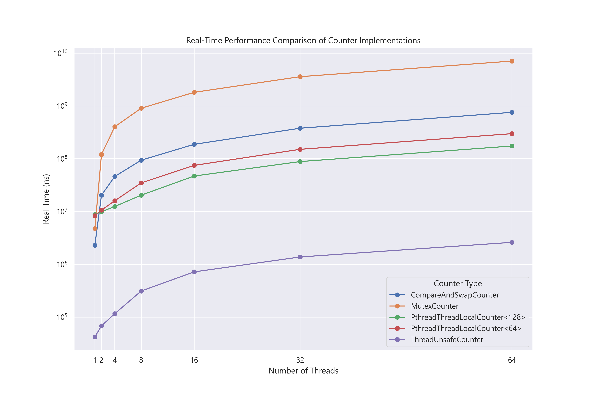

# Counter Benchmark

Want to verify the conclusion of the book _Operating Systems: Three Easy Pieces_ Chap 29.1.

Results show little difference among implementations.



`bazel run --config buildbuddy-readonly -c opt //one/codelab/counter_benchmark -- --benchmark_format=csv`

```python
import matplotlib.pyplot as plt
import pandas as pd
import seaborn as sns


data = pd.read_csv("data.csv", encoding="utf-8")
data[["benchmark_type", "thread_count"]] = data["name"].str.extract(
    r"<(.+)>/IterationsPerThread/(\d+)/real_time"
)
data["thread_count"] = data["thread_count"].astype(int)
data["real_time"] = data["real_time"].astype(float).round(2)

sns.set_theme()

summary = data.pivot_table(
    index="benchmark_type", columns="thread_count", values="real_time", aggfunc="sum"
)

plt.rcParams["font.family"] = "Segoe UI"

# Set up the plot
plt.figure(figsize=(12, 8))
for counter in summary.index:
    plt.plot(summary.columns, summary.loc[counter], marker="o", label=counter)

# Labeling the plot
plt.title("Real-Time Performance Comparison of Counter Implementations")
plt.xlabel("Number of Threads")
plt.ylabel("Real Time (ns)")
plt.yscale("log")  # Use logarithmic scale due to large range of values
plt.xticks(
    summary.columns, labels=summary.columns
)  # Ensure x-axis labels match thread counts
plt.legend(title="Counter Type")

# Show the plot
# plt.grid(True)
# plt.show()

plt.savefig("performance_comparison.png", dpi=300, format="png")
```